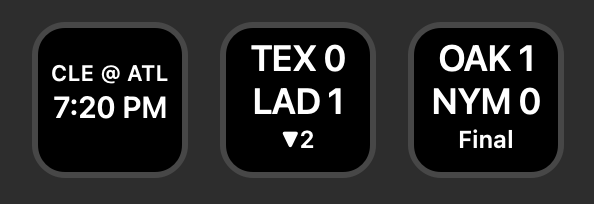
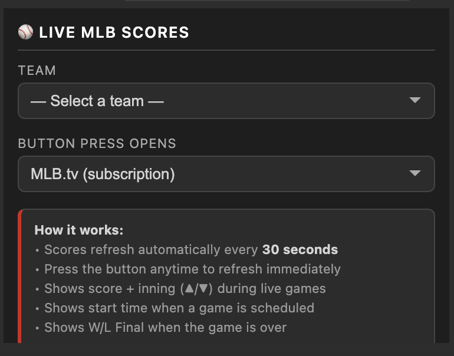

# Live MLB Scores — Stream Deck Plugin



A Stream Deck plugin that shows live MLB scores directly on your buttons. Each button tracks one team and updates automatically every 30 seconds.

 

---

## Features

- **Live scores** — shows away score, home score, and current inning while a game is in progress
- **Pre-game** — shows the matchup (e.g. `ATL @ NYM`) and scheduled start time
- **Final scores** — shows the final score with a "Final" label
- **Score-change flash** — when a team scores, the button flashes in that team's primary color
- **Browser shortcut** — press any button to open that game in MLB Gameday or MLB.tv
- **No-flicker updates** — buttons only redraw when the display actually changes
- **Multi-button support** — add as many team buttons as you want, each refreshes independently

---

## Recent Updates

**v1.0.1**
- Schedule holds on the current day's games until 2am local time, so late-running games stay on the button until they finish
- Pressing a button set to MLB.tv now opens Gameday instead if the game is more than an hour from first pitch

---


## Requirements

- [Elgato Stream Deck](https://www.elgato.com/stream-deck) hardware
- [Stream Deck software](https://www.elgato.com/downloads) version 6.0 or later (Mac or Windows)
- No MLB account required for scores — the plugin uses MLB's free public stats API

---

## Installation

1. Download the latest **`Live MLB Scores.streamDeckPlugin`** from the [Releases](../../releases) page
2. Double-click the file — Stream Deck will install it automatically
3. The plugin will appear in the Stream Deck action picker under **Live MLB Scores**

---

## Setup

1. Drag the **Live MLB Scores** action onto any button
2. In the settings panel on the right, select your team from the dropdown
3. Choose what happens when you press the button:
   - **MLB Gameday (free)** — opens the game's live Gameday page in your browser
   - **MLB.tv (subscription)** — opens the game's MLB.tv broadcast page



That's it. The button will load your team's game within a few seconds and refresh every 30 seconds from there.

---

## What the Button Shows

**Before the game:**
```
ATL @ NYM
 7:10 PM
```

**Live game:**
```
ATL  3
NYM  1
 ▲5
```

**Final score:**
```
ATL  3
NYM  1
Final
```

**Off day:**
```
  ATL
No Game
```

---

## Supported Teams

All 30 MLB teams are supported:

| AL East | AL Central | AL West |
|---|---|---|
| Baltimore Orioles | Chicago White Sox | Houston Astros |
| Boston Red Sox | Cleveland Guardians | Los Angeles Angels |
| New York Yankees | Detroit Tigers | Oakland Athletics |
| Tampa Bay Rays | Kansas City Royals | Seattle Mariners |
| Toronto Blue Jays | Minnesota Twins | Texas Rangers |

| NL East | NL Central | NL West |
|---|---|---|
| Atlanta Braves | Chicago Cubs | Arizona Diamondbacks |
| Miami Marlins | Cincinnati Reds | Colorado Rockies |
| New York Mets | Milwaukee Brewers | Los Angeles Dodgers |
| Philadelphia Phillies | Pittsburgh Pirates | San Diego Padres |
| Washington Nationals | St. Louis Cardinals | San Francisco Giants |

---

## How It Works

The plugin polls [MLB's free public Stats API](https://statsapi.mlb.com) once every 30 seconds per button. No API key or account is required. The plugin is fully self-contained — it uses only Node.js built-in modules and requires no external dependencies.

---

## Uninstalling

Open Stream Deck → Preferences → Plugins, select **Live MLB Scores**, and click the **−** button.

---

## Contributing

Bug reports and feature requests are welcome — open an [Issue](../../issues) to get started.

---

## Credits

Created by **T.J. Lauerman aka ThatSportsGamer**

Data provided by the [MLB Stats API](https://statsapi.mlb.com)
