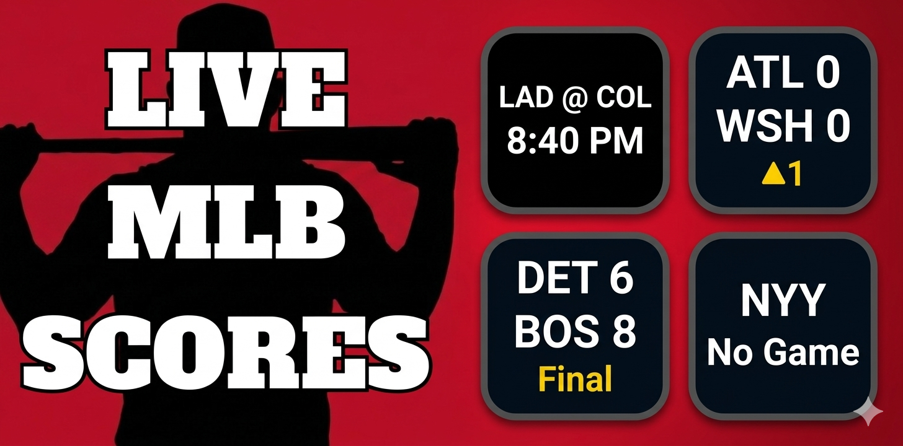
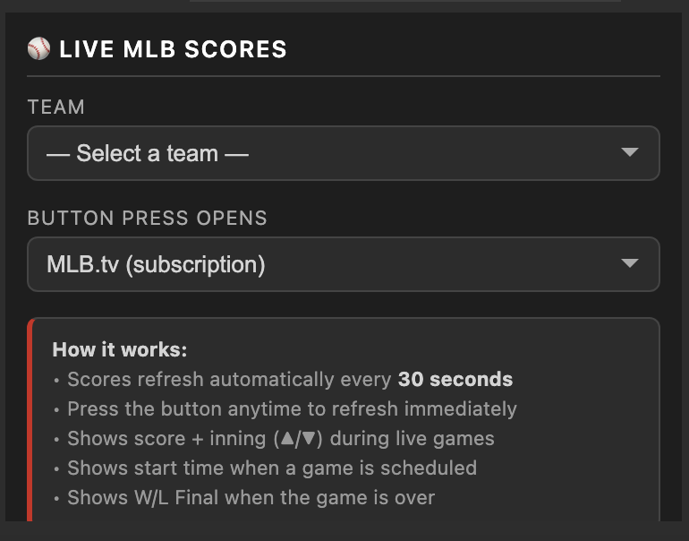
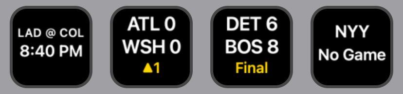

# Live MLB Scores — Stream Deck Plugin



A Stream Deck plugin that shows live MLB scores directly on your buttons. Each button tracks one team and updates automatically every 30 seconds.

 

---

## Features

- **Live scores** — shows away score, home score, and current inning while a game is in progress
- **Pre-game** — shows the matchup (e.g. `ATL @ NYM`) and scheduled start time
- **Final scores** — shows the final score with a "Final" label
- **Score-change flash** — when a team scores, the button flashes in that team's primary color
- **Browser shortcut** — press any button to open that game in MLB Gameday or MLB.tv; switches to Gameday automatically 30 minutes after the final out
- **Doubleheader support** — automatically shows Game 1, then switches to Game 2 when it ends; G1/G2 label keeps you oriented
- **Doubleheader toggle** — double-click a doubleheader button to peek at the other game; auto-reverts after 15 seconds
- **No-flicker updates** — buttons only redraw when the display actually changes
- **Multi-button support** — add as many team buttons as you want, each refreshes independently
- **All-Star Game coverage** — when your team has no game during the All-Star break, the button automatically shows the All-Star Game itself (AL in red, NL in blue) until it's over
- **Next game on off days** — instead of a dead-end "No Game", the button shows your team's next scheduled matchup, date, and time

---

## Recent Updates

**v1.0.25.0**
- Fixed: pressing a button set to MLB.tv during the Warmup state (right before first pitch, including right after a rain delay clears) fell back to Gameday instead of opening the stream — MLB.tv already carries Warmup as pre-game coverage, so it now opens directly

**v1.0.24.0**
- Coming out of a rain delay, the button now shows `WARMUP` alongside the original scheduled time instead of just re-displaying that now-stale clock as if nothing happened

**v1.0.23.0**
- Fixed: a pre-game weather delay (e.g. "Delayed Start") could be misread as a mid-game delay because MLB's linescore data pre-populates a "Top 1" shell before first pitch — this in turn caused the previous fix's MLB.tv fallback check to think the game had started and open the stream early. Now checks the game's actual live/preview status instead

**v1.0.22.0**
- Fixed: pressing a button set to MLB.tv for a game delayed past its scheduled start time no longer opens the stream early — the plugin now checks the game's actual status instead of the clock, so a rain delay correctly falls back to Gameday until the game actually begins

**v1.0.21.0**
- Fixed: Gameday links now use the correct calendar date for evening games — West Coast/Mountain teams whose game time crosses into the next UTC day (e.g. a 7:10pm Denver first pitch) were getting a link one day ahead of the real game

**v1.0.20.0**
- Fixed: Gameday links now use the correct URL suffix for the game's actual state — pressing a button for a preview, delayed, postponed, or "Next Game" matchup no longer sends you to a blank `/live` page

**v1.0.19.0**
- Trimmed the "Next Game" date to just month/day (e.g. `7/25`) instead of including the day of the week — the line was running out of room on the button

**v1.0.18.0**
- Fixed: the All-Star Game could return a broken MLB.tv link on years an AL park hosts it — Gameday fallback now correctly detects the game regardless of which league is home or away
- Fixed: postponed, suspended, and pre-game delayed games now carry full team info so the Gameday link opens the correct game instead of a generic fallback URL

**v1.0.17.0**
- On off days, the button now shows your team's next scheduled game (matchup, date, and time) instead of a dead-end "No Game"

**v1.0.16.0**
- Fixed: the inning/out indicator row now stays centered when a G1 or G2 label is shown during doubleheaders

**v1.0.15.0**
- Pre-game delays now show the updated start time alongside the DELAY indicator — if the first pitch gets pushed back, the button reflects the new time within 30 seconds

**v1.0.14.0**
- Fixed: button no longer switches to "Top 1" during pre-game warmups before first pitch — the matchup and start time stay visible until the game actually begins

**v1.0.13.0**
- During the All-Star break, a team button with no game now shows the All-Star Game instead of "No Game" — AL vs. NL score, inning, and out indicators, just like a regular game, with AL shown in red and NL in blue

**v1.0.12.0**
- Out indicators: two dots appear to the left of the inning — gray for unrecorded outs, red for recorded outs (inspired by classic out-of-town scoreboards)

**v1.0.9.0**
- After a game ends, pressing a button set to MLB.tv now opens Gameday instead — the MLB.tv link stays active for 30 minutes post-game to cover any post-game coverage, then switches automatically
- If the plugin loads and the game is already final, pressing the button goes straight to Gameday

**v1.0.8.0**
- Double-click a doubleheader button to peek at the other game — when Game 1 is active, see Game 2's start time; when Game 2 is active, see Game 1's final score
- Double-click again to snap back to the active game, or wait 15 seconds to auto-revert
- Single-clicking while viewing the other game opens that game's Gameday page
- Score changes and end-of-game fireworks always return the button to the active game view

**v1.0.7.0**
- Doubleheader support: automatically shows Game 1 until it ends, then switches to Game 2
- G1/G2 label appears next to the inning indicator, start time, or final/PPD/SUSP status so you always know which game you're watching
- Game 2 start time TBD handled gracefully — shows "TBD" instead of a blank or wrong time

**v1.0.6.0**
- Updated Oakland Athletics to Athletics (ATH) to reflect team's relocation to Sacramento

**v1.0.5.0**
- Updated action and category icons to white on transparent background
- Added plugin category for Stream Deck action picker grouping

**v1.0.4.0**
- PPD and SUSP now display in red — signals the game won't happen today
- Pre-game rain delay displays DELAY in blue
- Mid-game rain delay keeps the current score visible with DELAY in blue where the inning indicator normally sits

*Note: v1.0.3 was an internal build — all changes are included here.*

**v1.0.3**
- Inning indicator and "Final" label now display in yellow
- End-of-game fireworks animation with the winning team's name and colors

**v1.0.2**
- Added custom icons

**v1.0.1**
- Schedule holds on the current day's games until 2am local time, so late-running games stay on the button until they finish
- Pressing a button set to MLB.tv now opens Gameday instead if the game is more than an hour from first pitch

---


## Requirements

- [Elgato Stream Deck](https://www.elgato.com/stream-deck) hardware
- [Stream Deck software](https://www.elgato.com/downloads) version 6.0 or later (Mac or Windows)
- No account required to view scores — the plugin uses MLB's free public stats API
- An MLB.tv subscription is required only if you choose the MLB.tv link option; Gameday is free

---

## Installation

1. Download the latest **`Live MLB Scores.streamDeckPlugin`** from the [Releases](../../releases) page
2. Double-click the file — Stream Deck will install it automatically
3. The plugin will appear in the Stream Deck action picker under **Live MLB Scores**

---

## Setup

1. Drag the **Live MLB Scores** action onto any button
2. In the settings panel on the right, select your team from the dropdown
3. Choose what happens when you press the button:
   - **MLB Gameday (free)** — opens the game's live Gameday page in your browser
   - **MLB.tv (subscription)** — opens the game's MLB.tv broadcast page



That's it. The button will load your team's game within a few seconds and refresh every 30 seconds from there.

> **Note:** If MLB.tv is selected but the game hasn't started yet (more than 60 minutes away), pressing the button will open Gameday instead. After the final out, the button continues opening MLB.tv for 30 minutes to cover post-game coverage, then automatically switches to Gameday.

---

## What the Button Shows



**Before the game:**
```
ATL @ NYM
 7:10 PM
```

**Live game:**
```
ATL  3
NYM  1
 ▲5
```

**Final score:**
```
ATL  3
NYM  1
Final
```

**Off day:**
```
Next Game
ATL @ NYM
7/25 7:10 PM
```

---

## How It Works

The plugin polls [MLB's free public Stats API](https://statsapi.mlb.com) once every 30 seconds per button. No API key or account is required. The plugin is fully self-contained — it uses only Node.js built-in modules and requires no external dependencies.

The schedule holds on the current day's games until 2 AM local time, so late-running games stay on the button until they finish.

---

## Uninstalling

Open Stream Deck → Preferences → Plugins, select **Live MLB Scores**, and click the **−** button.

---

## Contributing

Bug reports and feature requests are welcome — open an [Issue](../../issues) to get started.

---

## Disclaimer

This plugin is not affiliated with, endorsed by, or sponsored by Major League Baseball or MLB Advanced Media, L.P. All data is sourced from the MLB Stats API and is subject to MLBAM's terms of use. This plugin is intended for individual, personal, non-commercial use only.

---

## Credits

Created by **T.J. Lauerman aka ThatSportsGamer**

Created with Claude Cowork by Anthropic

Data provided by the [MLB Stats API](https://statsapi.mlb.com)
